# sarapis
SVG library

## Flags

| Country code | Flag | Ratio | Name | Wiki |
| - | - | - | - | - |
| ad | 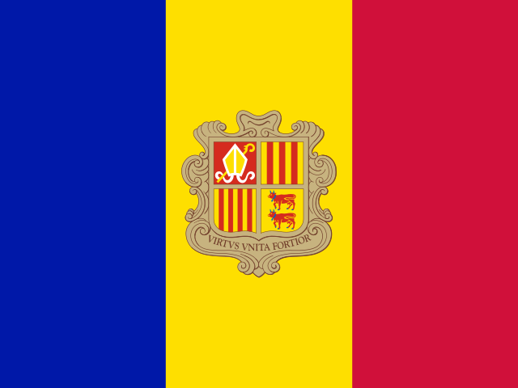 | ? | Andorra | |
| ae | 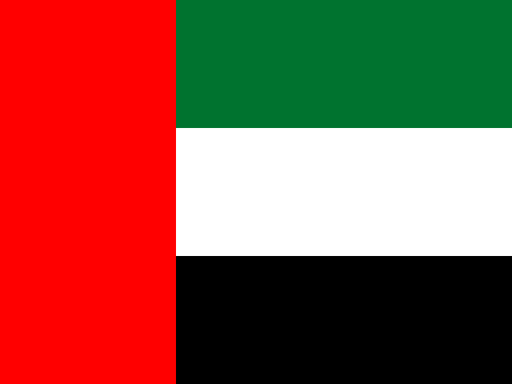 | ? | United Arab Emirates | |
| af | 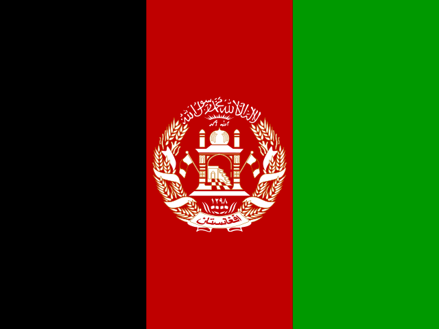 | ? | Afghanistan | |
| ag |  | ? | Antigua and Barbuda | |
| ai |  | ? | Anguilla | |
| al |  | ? | Albania | |
| am |  | ? | Armenia | |
| ao |  | ? | Angola | |
| aq |  | ? | Antarctica | |
| ar |  | ? | Argentina | |
| as |  | ? | American Samoa | |
| at |  | ? | Austria | |
| au |  | ? | Australia | |
| aw |  | ? | Aruba | |
| ax |  | ? | Åland Islands | |
| az |  | ? | Azerbaijan | |
| ba |  | ? | Bosnia and Herzegovina | |
| bb |  | ? | Barbados | |
| bd | 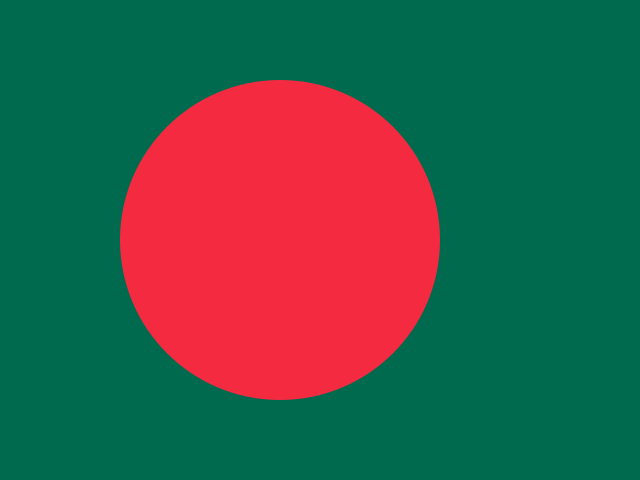 | ? | Bangladesh | |
| be |  | ? | Belgium | |
| bf |  | ? | Burkina Faso | |
| bg | 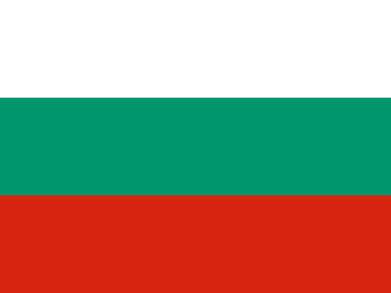 | ? | Bulgaria | |
| bh |  | ? | Bahrain | |
| bi |  | ? | Burundi | |
| bj |  | ? | Benin | |
| bl |  | ? | Saint Barthélemy | |
| bm |  | ? | Bermuda | |
| bn |  | ? | Brunei Darussalam | |
| bo |  | ? | Bolivia | |
| bq |  | ? | Bonaire, Sint Eustatius and Saba | |
| br |  | ? | Brazil | |
| bs |  | ? | Bahamas | |
| bt |  | ? | Bhutan | |
| bv |  | ? | Bouvet Island | |
| bw |  | ? | Botswana | |
| by |  | ? | Belarus | |
| bz |  | ? | Belize | |
| ca |  | ? | Canada | |
| cc |  | ? | Cocos (Keeling) Islands | |
| cd |  | ? | Congo, the Democratic Republic of the | |
| cf |  | ? | Central African Republic | |
| cg |  | ? | Congo | |
| ch |  | ? | Switzerland | |
| ci |  | ? | Cote D'Ivoire | |
| ck |  | ? | Cook Islands | |
| cl |  | ? | Chile | |
| cm |  | ? | Cameroon | |
| cn |  | ? | China | |
| co |  | ? | Colombia | |
| cr | 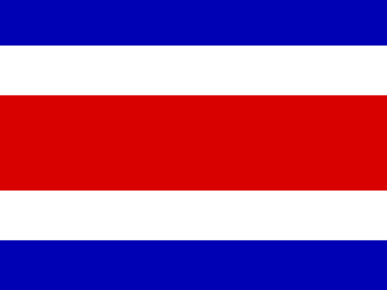 | ? | Costa Rica | |
| cu |  | ? | Cuba | |
| cv |  | ? | Cape Verde | |
| cw |  | ? | Curaçao | |
| cx |  | ? | Christmas Island | |
| cy |  | ? | Cyprus | |
| cz |  | ? | Czech Republic | |
| de |  | ? | Germany | |
| dj |  | ? | Djibouti | |
| dk |  | ? | Denmark | |
| dm |  | ? | Dominica | |
| do |  | ? | Dominican Republic | |
| dz |  | ? | Algeria | |
| ec | 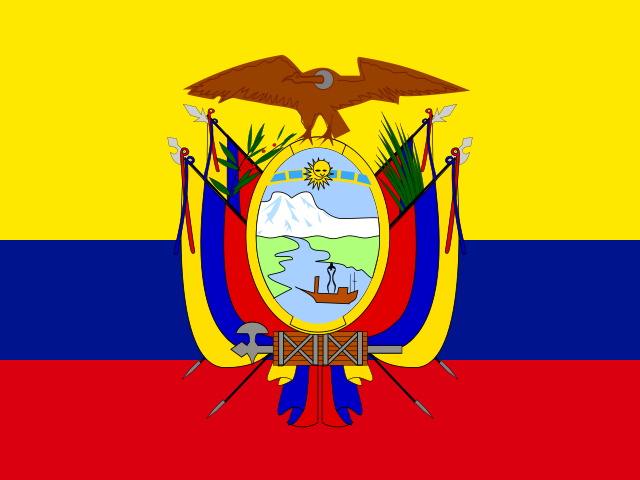 | ? | Ecuador | |
| ee |  | ? | Estonia | |
| eg |  | ? | Egypt | |
| eh |  | ? | Western Sahara | |
| er |  | ? | Eritrea | |
| es |  | ? | Spain | |
| et |  | ? | Ethiopia | |
| fi |  | ? | Finland | |
| fj |  | ? | Fiji | |
| fk |  | ? | Falkland Islands (Malvinas) | |
| fm |  | ? | Micronesia, Federated States of | |
| fo |  | ? | Faroe Islands | |
| fr |  | ? | France | |
| ga |  | ? | Gabon | |
| gb | 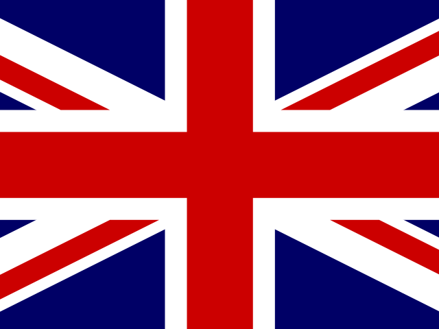 | 1:2 | United Kingdom | https://en.wikipedia.org/wiki/Flag_of_the_United_Kingdom |
| gd |  | ? | Grenada | |
| ge |  | ? | Georgia | |
| gf |  | ? | French Guiana | |
| gg |  | ? | Guernsey | |
| gh |  | ? | Ghana | |
| gi |  | ? | Gibraltar | |
| gl |  | ? | Greenland | |
| gm |  | ? | Gambia | |
| gn |  | ? | Guinea | |
| gp |  | ? | Guadeloupe | |
| gq |  | ? | Equatorial Guinea | |
| gr |  | ? | Greece | |
| gs |  | ? | South Georgia and the South Sandwich Islands | |
| gt |  | ? | Guatemala | |
| gu |  | ? | Guam | |
| gw |  | ? | Guinea-Bissau | |
| gy |  | ? | Guyana | |
| hk | 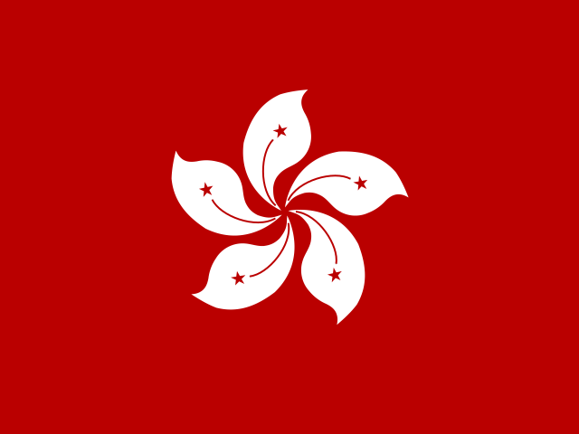 | ? | Hong Kong | |
| hm |  | ? | Heard Island and Mcdonald Islands | |
| hn |  | ? | Honduras | |
| hr |  | ? | Croatia | |
| ht |  | ? | Haiti | |
| hu |  | ? | Hungary | |
| id |  | ? | Indonesia | |
| ie |  | ? | Ireland | |
| il |  | ? | Israel | |
| im | 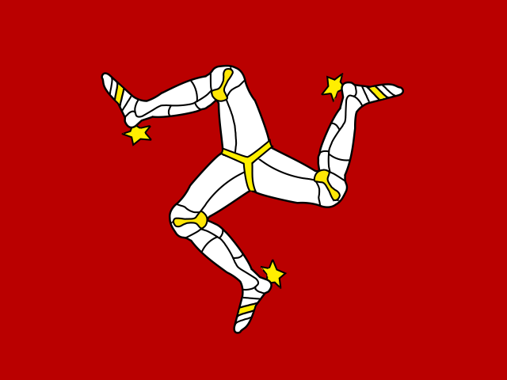 | ? | Isle of Man | |
| in |  | ? | India | |
| io |  | ? | British Indian Ocean Territory | |
| iq |  | ? | Iraq | |
| ir |  | ? | Iran, Islamic Republic of | |
| is |  | ? | Iceland | |
| it | 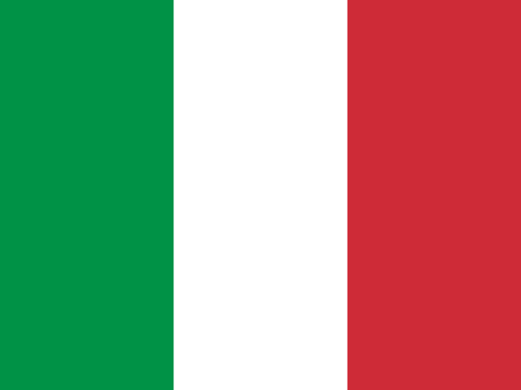 | ? | Italy | |
| je |  | ? | Jersey | |
| jm |  | ? | Jamaica | |
| jo |  | ? | Jordan | |
| jp |  | ? | Japan | |
| ke |  | ? | Kenya | |
| kg |  | ? | Kyrgyzstan | |
| kh |  | ? | Cambodia | |
| ki |  | ? | Kiribati | |
| km |  | ? | Comoros | |
| kn |  | ? | Saint Kitts and Nevis | |
| kp |  | ? | North Korea | |
| kr |  | ? | South Korea | |
| kw | 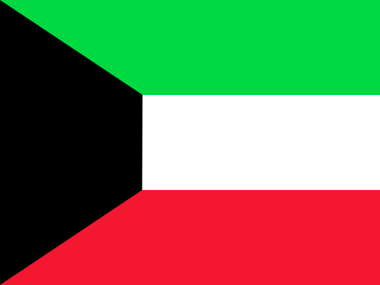 | ? | Kuwait | |
| ky |  | ? | Cayman Islands | |
| kz | 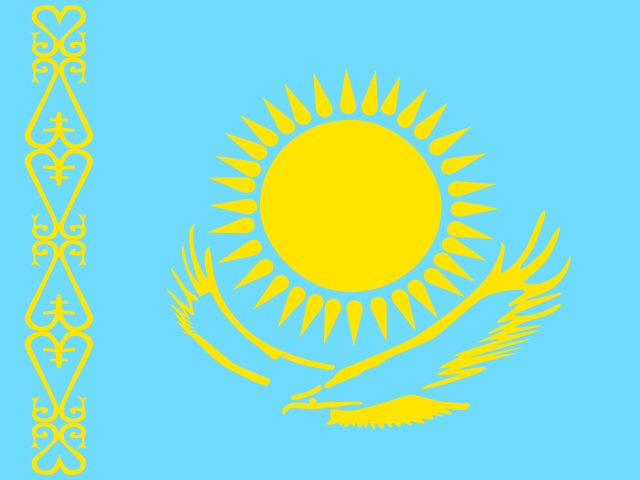 | ? | Kazakhstan | |
| la |  | ? | Lao People's Democratic Republic | |
| lb |  | ? | Lebanon | |
| lc |  | ? | Saint Lucia | |
| li |  | ? | Liechtenstein | |
| lk |  | ? | Sri Lanka | |
| lr | 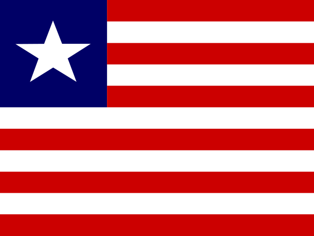 | ? | Liberia | |
| ls |  | ? | Lesotho | |
| lt |  | ? | Lithuania | |
| lu |  | ? | Luxembourg | |
| lv |  | ? | Latvia | |
| ly |  | ? | Libyan Arab Jamahiriya | |
| ma |  | ? | Morocco | |
| mc |  | ? | Monaco | |
| md |  | ? | Moldova, Republic of | |
| me |  | ? | Montenegro | |
| mf |  | ? | Saint Martin (French part) | |
| mg |  | ? | Madagascar | |
| mh |  | ? | Marshall Islands | |
| mk | 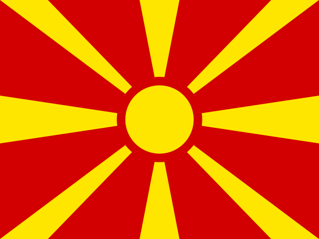 | ? | Macedonia, the Former Yugoslav Republic of | |
| ml |  | ? | Mali | |
| mm |  | ? | Myanmar | |
| mn |  | ? | Mongolia | |
| mo |  | ? | Macao | |
| mp |  | ? | Northern Mariana Islands | |
| mq |  | ? | Martinique | |
| mr |  | ? | Mauritania | |
| ms |  | ? | Montserrat | |
| mt |  | ? | Malta | |
| mu |  | ? | Mauritius | |
| mv |  | ? | Maldives | |
| mw |  | ? | Malawi | |
| mx |  | ? | Mexico | |
| my |  | ? | Malaysia | |
| mz |  | ? | Mozambique | |
| na |  | ? | Namibia | |
| nc |  | ? | New Caledonia | |
| ne |  | ? | Niger | |
| nf |  | ? | Norfolk Island | |
| ng |  | ? | Nigeria | |
| ni |  | ? | Nicaragua | |
| nl |  | ? | Netherlands | |
| no |  | ? | Norway | |
| np |  | ? | Nepal | |
| nr |  | ? | Nauru | |
| nu |  | ? | Niue | |
| nz |  | ? | New Zealand | |
| om |  | ? | Oman | |
| pa |  | ? | Panama | |
| pe |  | ? | Peru | |
| pf |  | ? | French Polynesia | |
| pg | 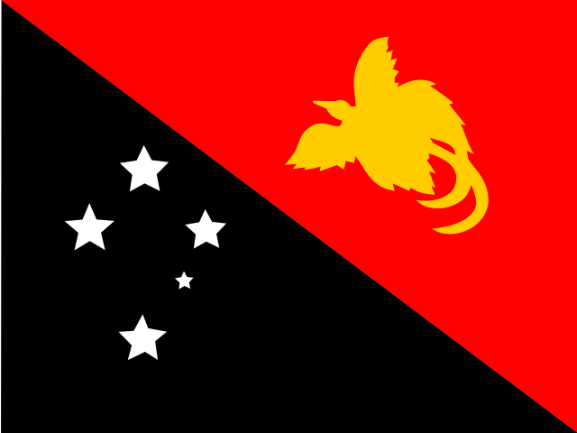 | ? | Papua New Guinea | |
| ph |  | ? | Philippines | |
| pk |  | ? | Pakistan | |
| pl |  | ? | Poland | |
| pm |  | ? | Saint Pierre and Miquelon | |
| pn |  | ? | Pitcairn | |
| pr |  | ? | Puerto Rico | |
| ps |  | ? | Palestinian Territory, Occupied | |
| pt | 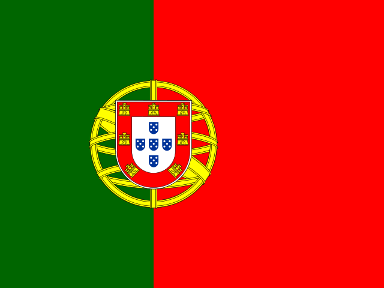 | ? | Portugal | |
| pw |  | ? | Palau | |
| py |  | ? | Paraguay | |
| qa | 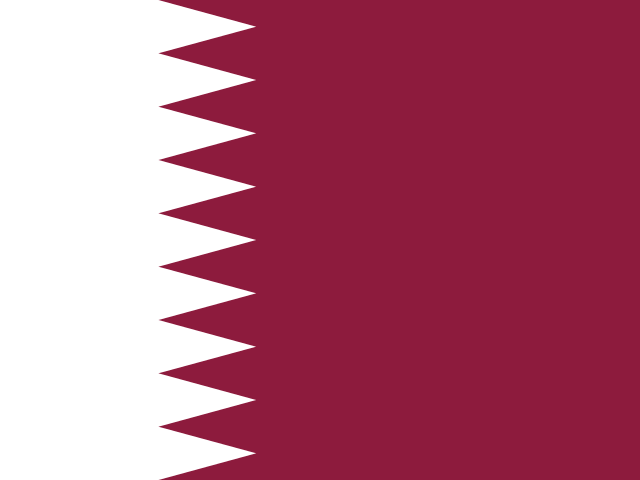 | ? | Qatar | |
| re |  | ? | Reunion | |
| ro |  | ? | Romania | |
| rs |  | ? | Serbia | |
| ru | 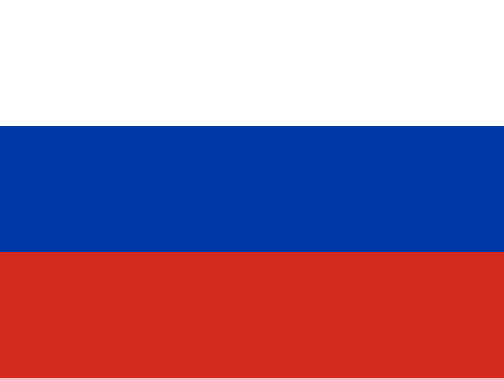 | ? | Russian Federation | |
| rw |  | ? | Rwanda | |
| sa |  | ? | Saudi Arabia | |
| sb |  | ? | Solomon Islands | |
| sc |  | ? | Seychelles | |
| sd |  | ? | Sudan | |
| se | 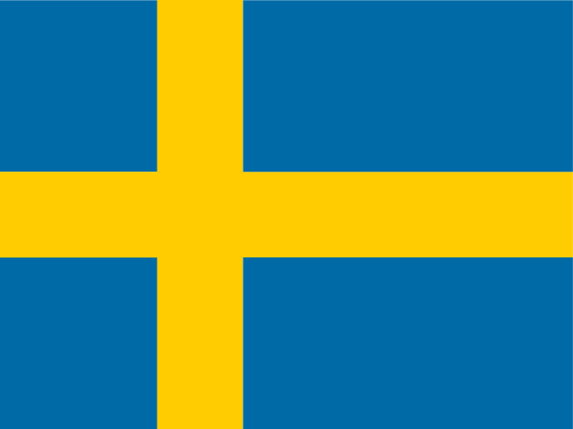 | ? | Sweden | |
| sg |  | ? | Singapore | |
| sh |  | ? | Saint Helena | |
| si |  | ? | Slovenia | |
| sj |  | ? | Svalbard and Jan Mayen | |
| sk |  | ? | Slovakia | |
| sl |  | ? | Sierra Leone | |
| sm | 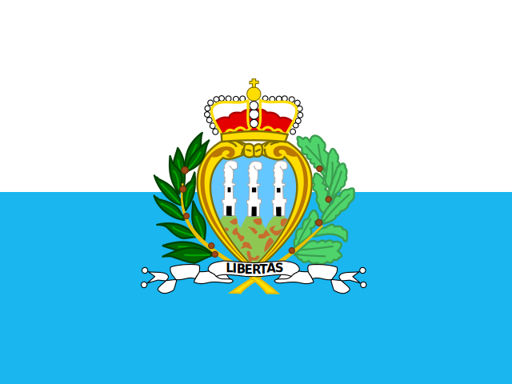 | ? | San Marino | |
| sn |  | ? | Senegal | |
| so |  | ? | Somalia | |
| sr |  | ? | Suriname | |
| ss |  | ? | South Sudan | |
| st |  | ? | Sao Tome and Principe | |
| sv |  | ? | El Salvador | |
| sx |  | ? | Sint Maarten (Dutch part) | |
| sy |  | ? | Syrian Arab Republic | |
| sz |  | ? | Swaziland | |
| tc |  | ? | Turks and Caicos Islands | |
| td |  | ? | Chad | |
| tf |  | ? | French Southern Territories | |
| tg |  | ? | Togo | |
| th |  | ? | Thailand | |
| tj |  | ? | Tajikistan | |
| tk |  | ? | Tokelau | |
| tl |  | ? | Timor-Leste | |
| tm |  | ? | Turkmenistan | |
| tn |  | ? | Tunisia | |
| to |  | ? | Tonga | |
| tr |  | ? | Turkey | |
| tt |  | ? | Trinidad and Tobago | |
| tv |  | ? | Tuvalu | |
| tw | 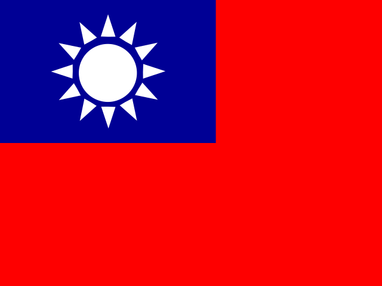 | ? | Taiwan | |
| tz |  | ? | Tanzania, United Republic of | |
| ua |  | ? | Ukraine | |
| ug |  | ? | Uganda | |
| um |  | ? | United States Minor Outlying Islands | |
| us |  | ? | United States of America | |
| uy |  | ? | Uruguay | |
| uz |  | ? | Uzbekistan | |
| va |  | ? | Holy See (Vatican City State) | |
| vc |  | ? | Saint Vincent and the Grenadines | |
| ve | 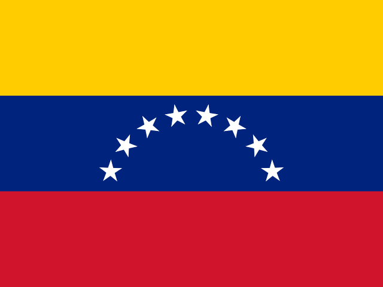 | ? | Venezuela | |
| vg |  | ? | Virgin Islands, British | |
| vi |  | ? | Virgin Islands, U.S. | |
| vn | 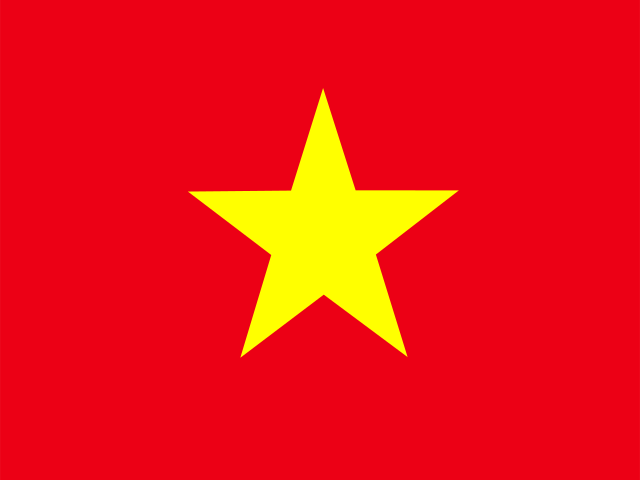 | ? | Viet Nam | |
| vu |  | ? | Vanuatu | |
| wf |  | ? | Wallis and Futuna | |
| ws |  | ? | Samoa | |
| xk |  | ? | Kosov | |
| ye |  | ? | Yemen | |
| yt |  | ? | Mayotte | |
| za |  | ? | South Africa | |
| zm |  | ? | Zambia | |
| zw |  | ? | Zimbabwe | |